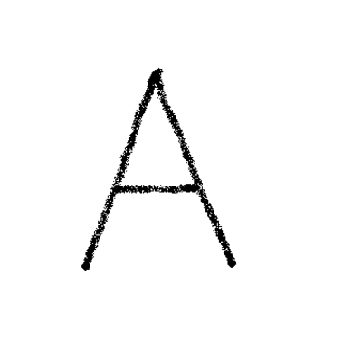
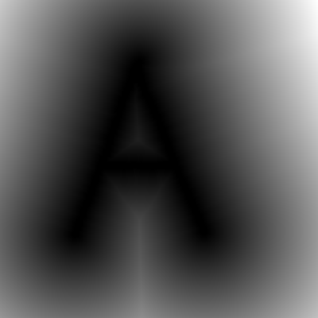
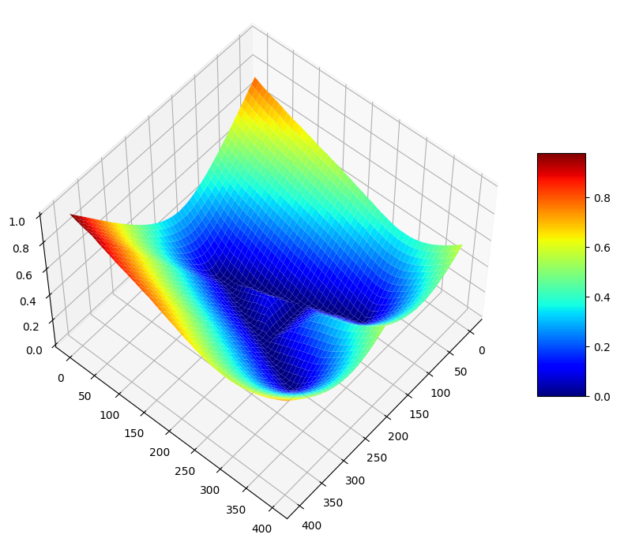
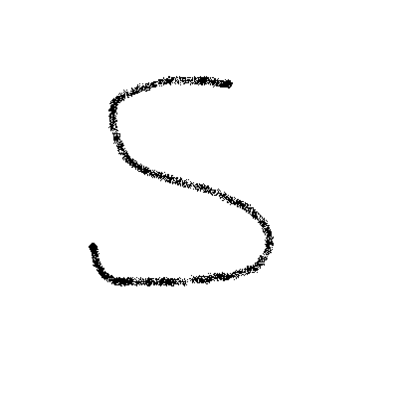
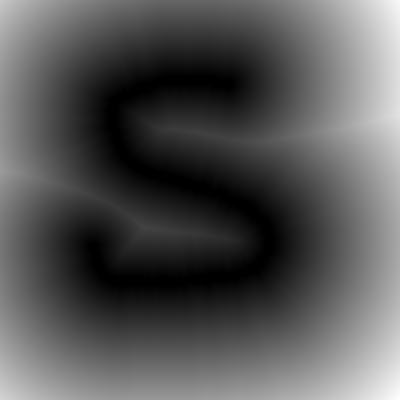
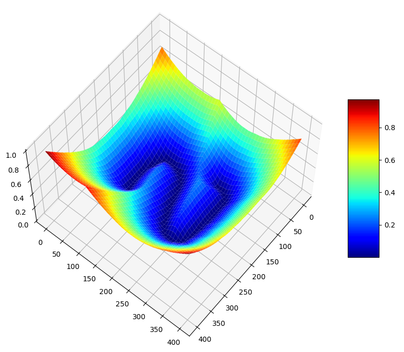
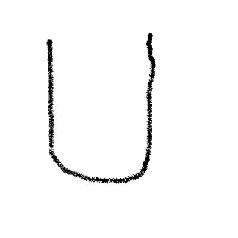
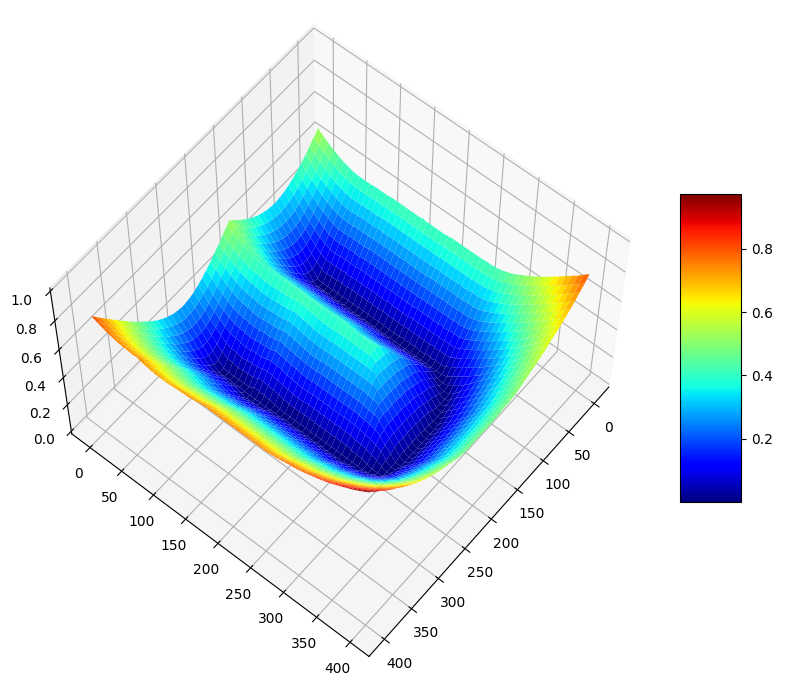
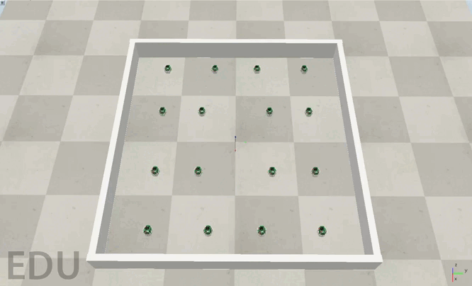

# shaped-swarm
This project develops a multi-robot swarm controller for pattern formation from hand-drawn images. Images are created using the airbrush in [Paint](https://jspaint.app/) tool. Further, they are processed using morphological operations and distance transformation to obtain a 2D signed distance field (SDF). The gradient of this SDF is used to derive controllers for pattern formation. 

All experiments were conducted using [CoppeliaSim v4.6.0 (rev. 8)](https://www.coppeliarobotics.com/downloads).

## Formation for word 'ASU'

### Signed Distance Field visualization
From left to right (Hand-drawn image of the pattern, 2D SDF of the pattern, 3D surface plot of the normalized SDF). The robots can be thought of as if they are following the downhill slope of the 3D surface shown below.

  
  
  

  
  
  

  
  
  

## Formation of a heart pattern

